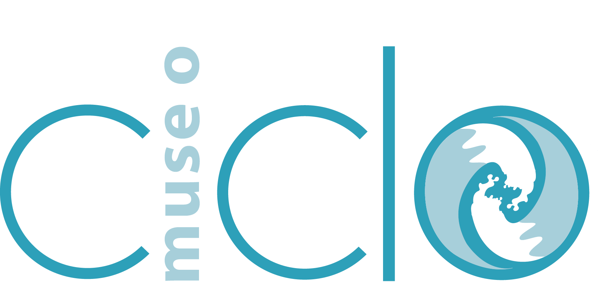
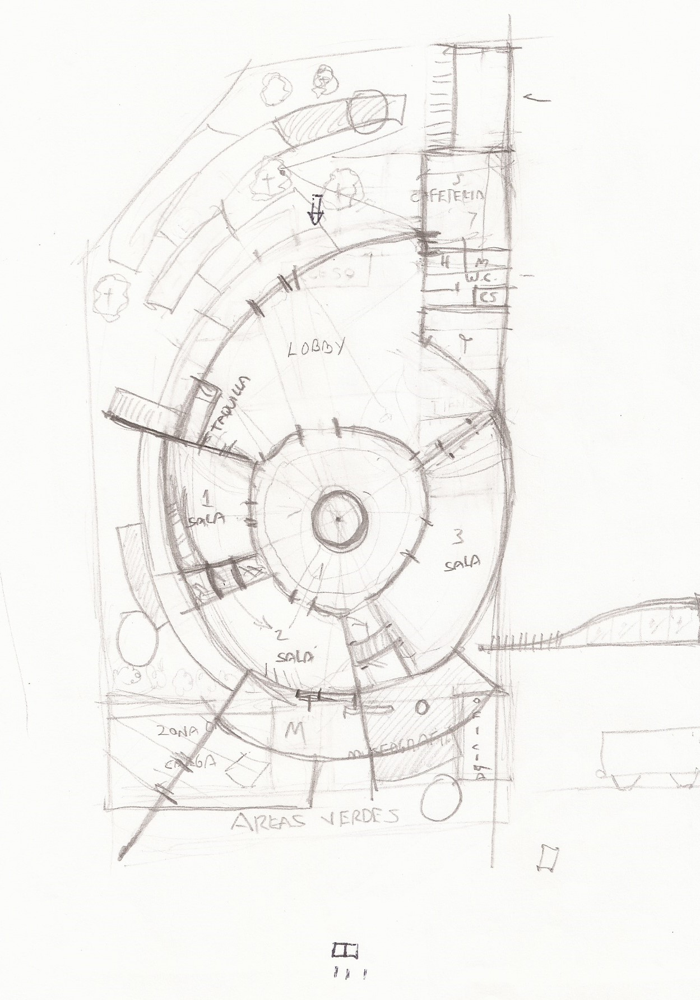
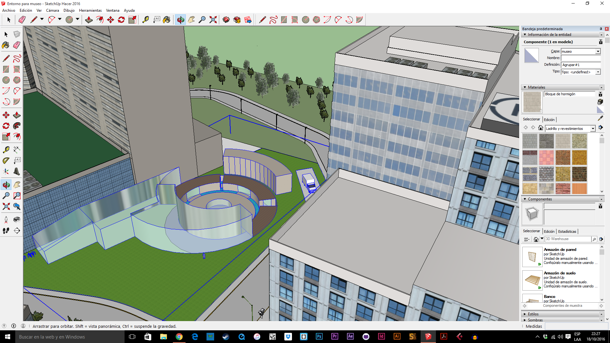
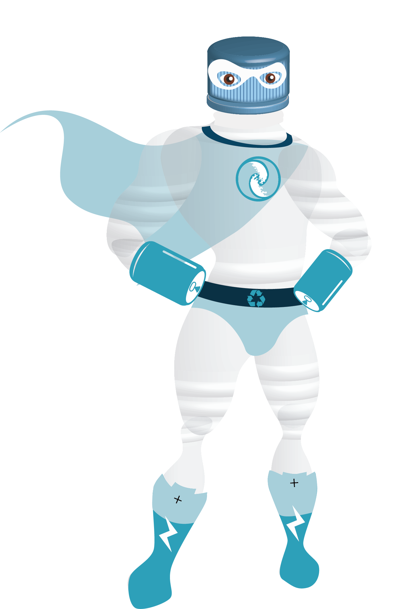
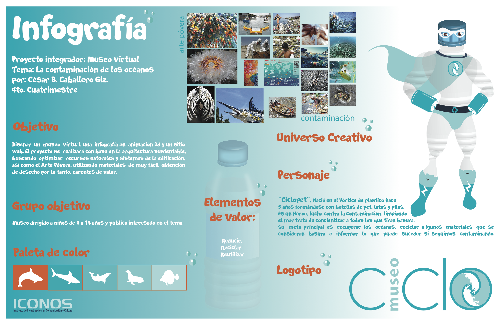

# Contaminación. La basura en los océanos

## Museo 

>Proyecto Integrador de cuarto cuatrimestre.

---

El siguiente proyecto es para *concientizar* a la gente que **Tira basura** en las playas :palm_tree:.
Según un reciente informe del **Programa de las Naciones Unidas para el Ambiente (PNUA)**, los plásticos, en particular las bolsas y las botellas en PET (Tereftalato de polietileno), son los residuos marinos más difundidos en el mundo: en muchos mares regionales representan más del **80% de los residuos.** :ocean:

Los residuos de plástico se acumulan en los ambientes terrestres y marinos de todo el mundo, se descomponen lentamente en pequeños pedazos tóxicos que pueden ser consumidos por los seres vivos a todos los niveles de la cadena alimentaria. Muchos animales, incluidos los mamíferos marinos, las aves, los peces y las tortugas, pueden confundir los plásticos por alimentos. Las tortugas marinas, en particular, confunden las bolsas flotantes con las medusas, uno de sus alimentos preferidos. Un estudio de cinco años de duración sobre los fulmares en la región del Mar del Norte, ha revelado que el 95% de estas aves contiene plástico en su propio estómago.

Materias     |  Activos
------------ |  ------------
Sonido Digital     |  *Ambientación*  
Css                |  *Sitio Web*     
Diseño de espacios |  *Organización*                 
Dibujo 3D          |  *Museo*         
Significación      |  *Impresos*      
Animación          |  *Infografía*  

# Guion Curatorial
Nombre del museo:  

## ciclo :cyclone:

Mucha gente no tiene idea del *valor de los océanos*, muchos sienten que esta agua no tiene valor debido a su contenido de sal. Sin embargo, es el hogar de una enorme cantidad de ** vida acuática **, sin ellos, no existiría la posibilidad tener oxígeno, entonces no habría seres humanos u otros seres vivos sobre la tierra.

La mayor parte del oxígeno que se **genera en el planeta proviene de los océanos**. La mayoría de las personas suponen que proviene de árboles y las plantas, y estas producen oxígeno, pero no en el volumen que se obtiene a partir de la vida acuática en los océanos.

Esta información sobre la contaminación de los océanos, te dará una nueva perspectiva de lo que está sucediendo. También te ayudará a darte cuenta de cómo todos podemos tomar acción ahora, para reducir el nivel de contaminación en los océanos y que el futuro sea mejor para todos.
La vida marina está desapareciendo a un ritmo acelerado debido a la contaminación en los mares y océanos. Esto puede ser debido al vertido intencional de residuos, los derrames de petróleo, e incluso debido a variedad de productos químicos agresivos.

# Objetivo general

Plantear a la sociedad que un elevado por ciento de la vida en el planeta Tierra habita en los océanos, pero muchos están luchando por sobrevivir. Se han visto negativamente afectados por la contaminación de los océanos, y si no les ayudamos la reacción en cadena podría ser demasiado grave para todos los seres vivos, incluyendo los seres humanos.

# Objetivos específicos

- **Concientizar** en nuestros espectadores un sentimiento que los haga recapacitar de forma consciente lo que implica tirar basura en las playas.
- **Difundir el problema** que implica el uso de plásticos y sus derivados ya que con ellos se modifica el desarrollo y fisonomía de la vida marina.
- **Recalcar y enfatizar** que en el océano ya existe un séptimo continente llamado Vórtice de plástico.
- ** Dar soluciones** ya que todos tenemos la responsabilidad de reducir la contaminación de nuestros océanos.

# Relación entre el tema de la exposición y el público al que va dirigido.

El tema, la contaminación en los océanos se aborda de manera general, la exposición como problema es mundial. El público deseado para visitar nuestro museo es de 6 años en adelante, esto se debe a que los niños son el futuro y desde ya debemos enseñarles a **tomar conciencia de lo que está sucediendo**. :recycle:

# Público al que va dirigido: 

Niños de 6 a 12 años :girl: :boy:

Salas |
---------|---------
Un mundo marino :whale: |---------
Del vórtice a tu mesa :earth_americas: |---------
Pesca tu solución :fish: |---------

# Plano del museo

# Volumetría

# Personaje

# Características del personaje

Nombre: **Ciclopet**, es la combinación del nombre del museo y el material del cual surgió, PET (polietileno tereftalato plástico muy usado en envases de bebidas y textiles, es un polímero termoplástico lineal, con un alto grado de cristalinidad).
Nació en el **Vórtice de plástico** hace 5 años, por la acumulación de desechos plásticos en el mar y el calentamiento global, formándose con botellas de plástico y pilas. Estas hicieron que tuviera un poder de energía capaz de levantar peso mayor al suyo.
# Personalidad:
Héroe su poder se caracteriza por luchar contra la Contaminación de los océanos, trata de mantener a raya a todos los que tiran basura además de concientizar cual es la problemática y sus consecuencias. Su causa, recuperar los océanos, reciclar algunos materiales que se consideran basura e informar lo que puede suceder si seguimos contaminando.
Hombre joven, estatura media, atlético, usa capa que hace que vuele con mayor agilidad, su traje está hecho con botellas de plástico, latas de refresco y pilas.

# Vínculos sociales: 
Se relaciona con otros individuos de su especie, logrando un ejército que le ayudará a limpiar y convencer al humano para lograr su cometido.
Pasado del personaje:
Su vida ha sido complicada ya que nació en un ambiente contaminado, rodeado de desechos y malos olores. Conforme se fue creando tuvo la conciencia de no ser siempre basura y convertirse algo útil al planeta, al ver como poco a poco se va desgastando se armó de partes de ellas, y de su mal lo transformo para ayudarse y combatir la problemática.

# Motivaciones:

El planeta tierra, el medio ambiente y sobre todas las especies que viven en los océanos, que poco a poco están muriendo por la contaminación que genera el humano.
Cometido:
Recuperar el océano, concientizar al ser humano del daño que le está causando a las especies marinas, pero sobre todo dar soluciones de lo que se puede hacer aun para tener un mejor planeta.
Papel en la historia:
Ser un ejemplo a seguir para lograr un cambio en la forma de pensar ante la problemática que es la Contaminación de los océanos.

# Brief del personaje

*¿En qué medio se empleará al personaje?*

En una infografía animada hecha en toonboom, que nos dará a conocer la problemática y soluciones a desarrollar para tener una mayor lectura del problema que estamos tomando.

*¿Cómo será usado el personaje?*

Como un elemento fundamental del proyecto integrador que será el guía de nuestro tema, así como el ejemplo a seguir para cambiar la forma de pensar del grupo objetivo.

*¿Cómo será mostrado el personaje?*

Caricaturizado y fuera de la realidad, pero con conciencia y sentimientos humanos.

*¿Se necesitan diferentes ángulos, poses y expresiones del personaje?*

Ángulos y poses sí, pero al ser una tapa de botella su rostro no se podrá tener expresiones, quizá eso se logrará con un cambio de colores que representen las emociones.

*¿El personaje hablará?*

Si

*¿El personaje debe ser simple o complejo?*

Simple

*¿A quién va dirigido el personaje?*

A niños de 5 a 12 años.

*¿Qué papel cumplirá el personaje?*

El ejemplo y héroe.

# Infografía

[Figma](https://www.figma.com/file/RNr11QdfkuIDC4Cs86PLjrlh/Untitled)

